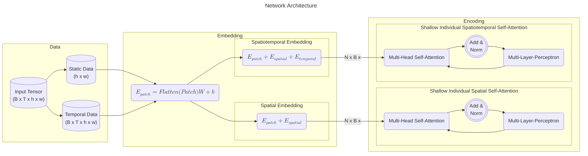

## Main Overview of Thesis Topic

### Guiding Research Questions
**Main RQ:** 
To what extent can (Bayesian) spatio-temporal transformers be used to predict sequence-to-sequence problems such as wildfire risk maps?

**Hypothesis:**

**Sub RQ:**
1. Can DL architectures be used to reliably quantify uncertainty in data and model?
2. How does the temporal scope of training data affect the temporal scope of trends learnt?
3. How does prediction uncertainty vary under extensive lead-time?
4. *(If Bayesian)* How can transformers be combined with uncertainty quantification such as bayesian statistics?

### Data

| Name | Description |Temporal Res. | Temporal Extent |Spatial Res. | d-type | Delivery Method |
| --- | --- | --- | --- | --- | --- | --- |
| MODIS | | | | | |
| FIRMS | | | | | |
| NVDI | | | | | |
| DTM | | | | | |

**Pipeline**:  

