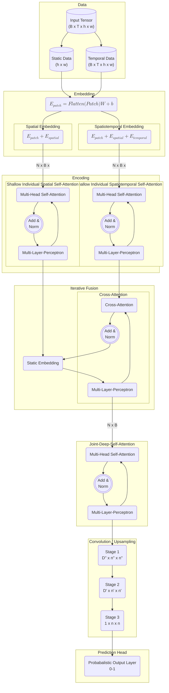

## Main Overview of Thesis Topic

### Guiding Research Questions
**Main RQ:** 
To what extent can (Bayesian) spatio-temporal transformers be used to predict sequence-to-sequence problems such as wildfire risk maps?

**Hypothesis:**

**Sub RQ:**
1. Can DL architectures be used to reliably quantify uncertainty in data and model?
2. How does the temporal scope of training data affect the temporal scope of trends learnt?
3. How does prediction uncertainty vary under extensive lead-time?
4. *(If Bayesian)* How can transformers be combined with uncertainty quantification such as bayesian statistics?

### Data

| Name | Description |Temporal Res. | Temporal Extent |Spatial Res. | Spatial Extent | d-type | Delivery Method |
| --- | --- | --- | --- | --- | --- | --- | --- |
| [NASA FIRMS MODIS](https://firms.modaps.eosdis.nasa.gov/country/)| Active fire / hotspot information available as Points(lon, lat, t), brightness, confidence  | continuous | 2001 - 2024| 1000m | worldwide | csv | Download |
| [Land Cover](https://www.sciencebase.gov/catalog/item/6345b637d34e342aee0863aa) | Type of Land Cover, Tree Canopy Cover| - | - | 30m | CONUS | GeoTIFF | Download |
| [DEM, ASPECT](https://apps.nationalmap.gov/downloader/) | Digital Elevation Model of US| - | - | 1m | CONUS | GeoTIFF, shp, GDB, GPKG |Download|
| ERA5 Re-analysis| Meteorological Products: Temperature, wind speed, wind direction, humidity, precipitation| daily | 1959 - 2025 | 31km | worldwide | NetCDF | Data Store / API |
| GRIDMET | Surface meteorology, precipitation, humidity | daily | 2001 - 2025| 4 km | CONUS | NetCDF | HTTPS / API |

### Network Architecture

